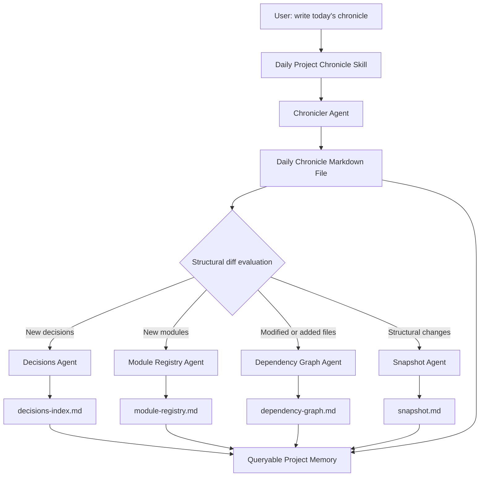

<div align="center">

# Claude Project Memory

### Persistent project memory for Claude Code and AI coding agents

Turn daily work, commits, architectural decisions, issues, and dependency graphs into an always-current memory layer that your AI assistant can query later.

<br />


<br />

**Stop re-explaining your codebase. Give Claude a memory.**

[Quick Start](#-quick-start) · [How It Works](#-how-it-works) · [Skills](#-skills) · [Vault Structure](#-vault-structure) · [Examples](#-example-prompts)

</div>

---

## What is this?

**Claude Project Memory** is a local, Markdown-based memory system for software projects.

It gives Claude a structured long-term memory of your project: what changed, why it changed, which decisions were made, which files matter, which issues are still open, and how the architecture evolved over time.

Instead of asking your AI assistant to rediscover the project from scratch every session, this system keeps a living project vault that Claude can read, update, and query.

```text
Your git repo + daily work
        ↓
Claude skills extract meaning
        ↓
Markdown vault stays updated
        ↓
Future Claude sessions understand the project instantly
```

---

## Why this exists

AI coding assistants are powerful, but they forget context between sessions.

You often have to repeat:

- what the project does
- why a library was chosen
- what broke last week
- which files are important
- what decisions were already made
- what bugs are still open
- what direction the project is moving in

This project solves that by turning your development history into **synthesized memory**, not just raw logs.

> **Core idea:** memory should be synthesis, not retrieval.
>
> Claude should not re-read every file and every note from scratch. It should start from a compact, curated, always-current project state.

---

## What you can ask Claude after setup

```text
What did we work on this week?
Why did we choose Polars instead of pandas?
When was the authentication module introduced?
Which files depend on detector.py?
What issues are still open?
When did this test start failing?
Show me the evolution of pipeline.py over the last month.
What contributed to the recommendation feature?
Generate a snapshot of the current project state.
```

Claude answers by reading the memory vault: daily chronicles, decision indexes, module registry, dependency graph, issue tracker, and project snapshot.

---

## Highlights

- **Persistent memory for coding projects** — keeps project knowledge across sessions
- **Claude Skills architecture** — each workflow is packaged as a reusable skill
- **Daily chronicles** — structured end-of-day notes based on git diff, commits, tests, and modified files
- **Automatic downstream updates** — decisions, modules, dependencies, and snapshots are updated when needed
- **Queryable history** — ask natural-language questions about project evolution
- **Local-first Markdown vault** — works with Obsidian or any Markdown editor
- **Git-aware** — combines narrative memory with precise git history
- **Issue tracking** — manage open, in-progress, and resolved issues inside the vault
- **Dependency graph** — track internal file relationships and high-impact files
- **Vault linting** — find broken links, stale claims, contradictions, and orphan entries

---

## Quick start

### 1. Clone the repository

```bash
git clone https://github.com/<your-username>/claude-project-memory.git
cd claude-project-memory
```

Or download the repository as a ZIP and extract it.

---

### 2. Create a memory vault

The vault is where project memory lives. It can be inside or outside your code repository.

```bash
mkdir -p ~/Documents/my-project-vault
cp -r vault-template/* ~/Documents/my-project-vault/
```

Create your local config:

```bash
cp ~/Documents/my-project-vault/project.config.yaml.example \
   ~/Documents/my-project-vault/project.config.yaml
```

Edit `project.config.yaml`:

```yaml
project_name: my-project
repo_path: /absolute/path/to/your/git/repo
vault_path: /absolute/path/to/your/memory/vault
language: english # english | italiano
```

> `project.config.yaml` is gitignored because it contains machine-specific absolute paths.

---

### 3. Install the Claude skills

Copy the skill folders into the directory where Claude can access custom skills.

For Cowork-style environments, this is typically:

```bash
/mnt/skills/user/
```

Install all skills:

```bash
cp -r skills/daily-project-chronicle /mnt/skills/user/
cp -r skills/read-chronicles         /mnt/skills/user/
cp -r skills/manage-issues           /mnt/skills/user/
cp -r skills/project-snapshot        /mnt/skills/user/
cp -r skills/init-dependency-graph   /mnt/skills/user/
cp -r skills/commit-semantic-extract /mnt/skills/user/
cp -r skills/vault-lint              /mnt/skills/user/
```

Then ask Claude:

```text
What skills do you have?
```

If installation worked, Claude should be able to see the project memory skills.

---

### 4. Initialize an existing project

For a project that already has code and git history, run these commands in Claude:

```text
initialize the dependency graph
```

Then:

```text
generate the project snapshot
```

Then:

```text
write today's chronicle
```

From now on, the daily chronicle skill keeps the memory vault updated incrementally.

---

### 5. Daily workflow

At the end of a work session, ask Claude:

```text
write today's chronicle
```

Claude will:

1. inspect git changes and commit history
2. write a structured daily note
3. detect whether decisions, modules, dependencies, or architecture changed
4. update the relevant vault indexes
5. report what was written and what changed

---

## How it works

The system is built around a daily memory pipeline.



The daily chronicle is the raw narrative layer. The indexes are the compressed memory layer.

Claude reads the indexes first, then follows links into daily chronicles only when deeper context is needed.

---

## Repository structure

```text
claude-project-memory/
├── README.md
├── ONBOARDING.md
├── skills/
│   ├── README.md
│   ├── daily-project-chronicle/
│   │   ├── SKILL.md
│   │   └── agents/
│   │       ├── chronicler.md
│   │       ├── decisions-agent.md
│   │       ├── module-registry-agent.md
│   │       ├── dependency-graph-agent.md
│   │       └── snapshot-agent.md
│   ├── read-chronicles/
│   │   └── SKILL.md
│   ├── manage-issues/
│   │   ├── SKILL.md
│   │   └── agents/
│   │       └── issue-manager.md
│   ├── project-snapshot/
│   │   ├── SKILL.md
│   │   └── agents/
│   │       └── snapshot-builder.md
│   ├── init-dependency-graph/
│   │   ├── SKILL.md
│   │   └── agents/
│   │       └── dependency-scanner.md
│   ├── commit-semantic-extract/
│   │   ├── SKILL.md
│   │   └── agents/
│   │       └── semantic-extractor.md
│   └── vault-lint/
│       ├── SKILL.md
│       └── agents/
│           └── lint-agent.md
└── vault-template/
    ├── project.config.yaml.example
    ├── .gitignore
    ├── Meta/
    │   └── vault-index.md
    ├── Project/
    │   ├── snapshot.md
    │   ├── decisions-index.md
    │   ├── module-registry.md
    │   ├── open-issues.md
    │   └── dependency-graph.md
    └── Templates/
        └── daily-chronicle-template.md
```

---

## Skills

| Skill | What it does | When to use it |
|---|---|---|
| `daily-project-chronicle` | Writes the daily project note and runs downstream update agents | Every work session |
| `read-chronicles` | Answers questions about project history, fixes, decisions, modules, and periods | Whenever you need context |
| `manage-issues` | Adds, lists, updates, and resolves project issues in the vault | When tracking bugs or open work |
| `project-snapshot` | Generates a current-state project summary from the vault and repo | First setup or recovery |
| `init-dependency-graph` | Performs a full repository dependency scan | First setup for existing projects |
| `commit-semantic-extract` | Searches commit history semantically for feature-related work | On demand |
| `vault-lint` | Checks the memory vault for broken links, contradictions, and stale entries | Monthly or after heavy edits |

---

## Vault structure

A vault created from `vault-template/` looks like this:

```text
my-project-vault/
├── project.config.yaml
├── Daily/
│   └── YYYY-MM-DD-daily-project-chronicle.md
├── Project/
│   ├── snapshot.md
│   ├── decisions-index.md
│   ├── module-registry.md
│   ├── open-issues.md
│   └── dependency-graph.md
├── Meta/
│   └── vault-index.md
└── Templates/
    └── daily-chronicle-template.md
```

### `Daily/`

Contains generated daily chronicles. These are the narrative memory of the project.

Each chronicle can include:

- summary of the day
- code changes
- test results
- reliability notes
- data/storage changes
- decisions
- open issues
- next steps

### `Project/snapshot.md`

The current compressed state of the project.

Claude reads this first when it needs to understand what the project does now.

### `Project/decisions-index.md`

A table of architectural, technical, and organizational decisions.

Use it to answer:

```text
Why did we choose X?
When did we decide Y?
What alternatives were rejected?
```

### `Project/module-registry.md`

A registry of important files and modules.

Use it to answer:

```text
When was this module introduced?
What subsystem does this file belong to?
Where should I look before editing this feature?
```

### `Project/dependency-graph.md`

A project-level dependency map between internal files.

Use it to answer:

```text
What files depend on this one?
Which files are high-impact hotspots?
What might break if I edit this module?
```

### `Project/open-issues.md`

A lightweight issue tracker inside the memory vault.

Use it to track bugs, open questions, known problems, and resolved issues.

---

## Example prompts

### Write memory

```text
write today's chronicle
write today's chronicle focusing on the detection pipeline
log what we did yesterday
```

### Query project history

```text
What did we work on this week?
Summarize the last 14 days.
What changed between May 1 and May 7?
```

### Query decisions

```text
Why did we choose this architecture?
When did we decide to split the pipeline into modules?
Show me all architectural decisions.
```

### Query modules and files

```text
When was score_detection.py introduced?
Show me the evolution of pipeline.py.
What depends on detector.py?
Which files are the most risky to modify?
```

### Query bugs and tests

```text
When did this error first appear?
Find this traceback in the chronicles.
When was ISSUE-003 fixed?
What problems are still open?
```

### Manage issues

```text
add issue: the assignment step returns unassigned pins when detections are close
list open issues
mark ISSUE-002 as in progress
mark ISSUE-002 as resolved
```

### Maintenance

```text
lint the vault
check vault health
find contradictions in the vault
```

---

## Recommended workflow

For a new project:

```text
write today's chronicle
```

For an existing project:

```text
initialize the dependency graph
generate the project snapshot
write today's chronicle
```

For normal development:

```text
1. Work on the code
2. Commit or leave meaningful git changes
3. Ask Claude: "write today's chronicle"
4. Let the skill update the vault
5. Ask future questions naturally
```

For maintenance:

```text
lint the vault
```

Run this periodically, especially after large refactors or manual vault edits.

---

## Design philosophy

This system follows a few simple rules:

### 1. Memory should be structured

A pile of notes is not memory. The vault separates narrative history from durable indexes.

### 2. Memory should be incremental

The system updates what changed instead of rebuilding everything from scratch every time.

### 3. Memory should be queryable

Claude should be able to answer questions like a teammate who remembers the project.

### 4. Memory should stay local

The vault is plain Markdown. You can version it, edit it, sync it, or open it in Obsidian.

### 5. Git tells what changed. Chronicles explain why.

Git history gives precision. Chronicles give intent. The system uses both.

---

## Compatibility

| Area | Supported |
|---|---|
| Repository type | Any git repository |
| Vault format | Markdown |
| Editor | Obsidian recommended, any Markdown editor works |
| Languages | Python, JavaScript, TypeScript, Rust, Java, Go, Ruby, PHP, C/C++, and more |
| OS | Linux, macOS, Windows with WSL or compatible environment |
| Assistant | Claude with custom skills support, Cowork-style environments, or equivalent skill loaders |

---

## Privacy notes

- The memory vault is local Markdown.
- `project.config.yaml` is gitignored by default.
- Absolute paths stay in your local config.
- You decide whether to commit the generated vault, keep it private, or sync it with Obsidian.
- The system does not require a database or hosted service.

---

## Limitations

This project is intentionally simple and local-first.

- It requires an environment where Claude can access custom skills and local files.
- It does not replace git, issue trackers, or documentation systems.
- The quality of memory depends on the quality of daily chronicles and commits.
- Semantic contradictions may require human review; `vault-lint` flags them instead of guessing silently.

---

## Roadmap ideas

Potential future improvements:

- install script for skills and vault setup
- sample demo vault
- GitHub Action for vault linting
- richer dependency graph visualizations
- support for multiple repositories in one vault
- memory export format for other AI coding agents
- optional command-line wrapper

---

## Contributing

Contributions are welcome.

Good first contributions:

- improve skill triggers
- add examples and demo vaults
- improve language support
- add setup scripts
- test the system on real repositories
- improve dependency scanning instructions for specific languages

Before opening a pull request:

1. test the modified skill on a sample vault
2. make sure the vault template still initializes correctly
3. do not commit `project.config.yaml`
4. keep prompts clear, deterministic, and easy to debug

---

## Star the project

If this saves you from re-explaining your project to Claude every session, consider starring the repo.

It helps more developers discover the idea of local, synthesized project memory for AI coding agents.

---

<div align="center">

**Claude Project Memory**

A Markdown memory layer for software projects that want their AI assistant to remember.

</div>
